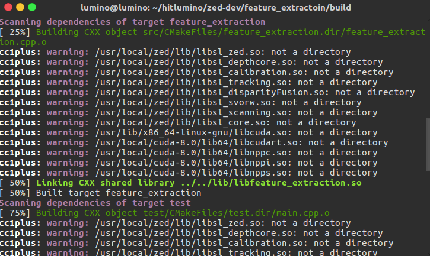

# 问题汇总：
## 1. cmake 编译警告 /usr/local/zed/lib/libsl_zed.so: not a directory

　  
　CMakeLists.txt文件如下：  
```
SET(execName feature-extra)
cmake_minimum_required( VERSION 2.8 )
project(${execName})

if(COMMAND cmake_policy)
	cmake_policy(SET CMP0003 OLD)
	cmake_policy(SET CMP0015 OLD)
endif(COMMAND cmake_policy)

SET(EXECUTABLE_OUTPUT_PATH ".")    
SET(VERSION_REQ_CUDA "8.0")

IF(WIN32) # Windows
    if (CMAKE_CL_64)  
        SET(ZED_INCLUDE_DIRS $ENV{ZED_INCLUDE_DIRS})
        SET(ZED_LIBRARIES $ENV{ZED_LIBRARIES_64})
        SET(ZED_LIBRARY_DIR $ENV{ZED_LIBRARY_DIR})
    else()
        message(FATAL_ERROR "You've selected the 32bit version of ${CMAKE_GENERATOR}. \n Please delete the cache (file->Delete Cache) and use the 64bit version. (${CMAKE_GENERATOR} Win64)")
    endif()
ELSE() # Linux
    find_package(ZED 2.1 REQUIRED)
    SET(SPECIAL_OS_LIBS "pthread" "X11")
    add_definitions(-std=c++0x -O3 -pthread)
    set( EXECUTABLE_OUTPUT_PATH ${PROJECT_SOURCE_DIR}/bin )
    set( LIBRARY_OUTPUT_PATH ${PROJECT_SOURCE_DIR}/lib )
ENDIF(WIN32)

# OpenCV
find_package( OpenCV 3.1 REQUIRED )
include_directories( ${OpenCV_INCLUDE_DIRS} )

#CUDA
find_package(CUDA ${VERSION_REQ_CUDA} REQUIRED)
include_directories(${CUDA_INCLUDE_DIRS})

#ZED
include_directories(${ZED_INCLUDE_DIRS})

include_directories(${CMAKE_CURRENT_SOURCE_DIR}/include)

# 添加cmake模块以使用g2o
# list( APPEND CMAKE_MODULE_PATH ${PROJECT_SOURCE_DIR}/cmake_modules )


include_directories( 
    ${OpenCV_INCLUDE_DIRS} 
    ${ZED_LIBRARIES}
    ${SPECIAL_OS_LIBS}#这个不加编译不了
    ${CUDA_CUDA_LIBRARY} ${CUDA_CUDART_LIBRARY} ${CUDA_npp_LIBRARY} 
    "/usr/include/eigen3/"
)
add_subdirectory( src )
add_subdirectory( test )
```
### 解决方案及其思路：
```
include_directories( 
    ${OpenCV_INCLUDE_DIRS} 
    ${ZED_LIBRARIES}
    ${SPECIAL_OS_LIBS}#这个不加编译不了
    ${CUDA_CUDA_LIBRARY} ${CUDA_CUDART_LIBRARY} ${CUDA_npp_LIBRARY} 
    "/usr/include/eigen3/"
)
```
cc1plus: warning: /usr/local/zed/lib/libsl_zed.so: not a directory  
cc1plus: warning: /usr/local/zed/lib/libsl_depthcore.so: not a directory  
cc1plus: warning: /usr/local/zed/lib/libsl_calibration.so: not a directory  
cc1plus: warning: /usr/local/zed/lib/libsl_tracking.so: not a directory  
cc1plus: warning: /usr/local/zed/lib/libsl_disparityFusion.so: not a directory  
cc1plus: warning: /usr/local/zed/lib/libsl_svorw.so: not a directory  
cc1plus: warning: /usr/local/zed/lib/libsl_scanning.so: not a directory  
cc1plus: warning: /usr/local/zed/lib/libsl_core.so: not a directory  
cc1plus: warning: /usr/lib/x86_64-linux-gnu/libcuda.so: not a directory  
cc1plus: warning: /usr/local/cuda-8.0/lib64/libcudart.so: not a directory  
cc1plus: warning: /usr/local/cuda-8.0/lib64/libnppc.so: not a directory  
cc1plus: warning: /usr/local/cuda-8.0/lib64/libnppi.so: not a directory  
cc1plus: warning: /usr/local/cuda-8.0/lib64/libnpps.so: not a directory  

很明显与zed和cuda的库有关，`include_directories`与`not a directory`对应，因此应该这里出错。  

```
add_executable( test main.cpp )
target_link_libraries( test feature_extraction )
#很重要！！！
TARGET_LINK_LIBRARIES(test
                        ${ZED_LIBRARIES}
                        ${OpenCV_LIBRARIES}
                        ${SPECIAL_OS_LIBS}#这个不加编译不了
                        ${CUDA_CUDA_LIBRARY} ${CUDA_CUDART_LIBRARY} ${CUDA_npp_LIBRARY} )
```
与之对应的是在`test`文件夹中的`CMakeLists.txt`里  
`TARGET_LINK_LIBRARIES`:指定链接库，这里不是以目录形式，因此，显然在`工程目录`下的cmake文件就不应当包含有关`zed`和`cuda`相关库，因为用不到。
其次，可以对比到：`${OpenCV_INCLUDE_DIRS} `和`${ZED_LIBRARIES}`，显然opencv的库是以目录形式存在的。所以应该使用`include_directories`。  
至于，opencv库应该被那个CMakeLists.txt指定链接？实验证明并无差异，最好都写了吧。
最后CMakeLists.txt为：
```
include_directories( 
    ${OpenCV_INCLUDE_DIRS} 
    "/usr/include/eigen3/"
)
```

## 2.`bin`文件夹里没有出现可执行文件，还是在build的`test`文件夹里
  
```
ELSE() # Linux
    find_package(ZED 2.1 REQUIRED)
    SET(SPECIAL_OS_LIBS "pthread" "X11")
    add_definitions(-std=c++0x -O3 -pthread)
    set( EXECUTABLE_OUTPUT_PATH ${PROJECT_SOURCE_DIR}/bin )
    set( LIBRARY_OUTPUT_PATH ${PROJECT_SOURCE_DIR}/lib )
ENDIF(WIN32)
```
### 解决方案：
一定要在`add_subdirectory(bin)`之前`set( EXECUTABLE_OUTPUT_PATH ${PROJECT_SOURCE_DIR}/bin )`  
注意`Linking CXX executable test`与`Linking CXX executable ../../bin/test`差别   　
(不正确如下)  
```
lumino@lumino:~/hitlumino/zed-dev/feature_extractoin/build$ make
Scanning dependencies of target feature_extraction
[ 25%] Building CXX object src/CMakeFiles/feature_extraction.dir/feature_extraction.cpp.o
[ 50%] Linking CXX shared library libfeature_extraction.so
[ 50%] Built target feature_extraction
Scanning dependencies of target test
[ 75%] Building CXX object test/CMakeFiles/test.dir/main.cpp.o
[100%] Linking CXX executable test
[100%] Built target test
```
---------------　(正确如下)----------------　

```
lumino@lumino:~/hitlumino/zed-dev/feature_extractoin/build$ make
[ 25%] Linking CXX shared library ../../lib/libfeature_extraction.so
[ 50%] Built target feature_extraction
[ 75%] Linking CXX executable ../../bin/test
[100%] Built target test
```

